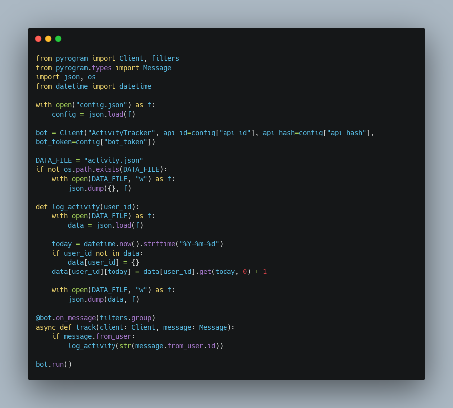

# tg-activity-tracker 📊

Track user activity in Telegram groups and generate statistical data for weekly reports or integration with admin dashboards.

## ⚙️ Features  
- Daily message count logging per user  
- JSON-based data storage for easy processing  
- Compatible with reporting tools or dashboards  
- Lightweight and modular structure

## 🚀 How to Run  
1. Copy `config.sample.json` to `config.json` and fill in your values  
2. Install dependencies:  
pip install -r requirements.txt  
3. Run the bot:  
python tracker.py

## 🧠 Author  
Built by PeTeR — expert in control, security, and viral tool design

## 📄 License  
MIT — free to use, modify, and distribute