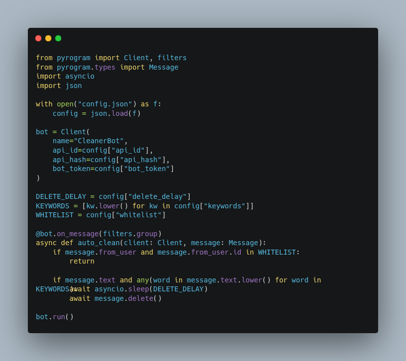

apple
# tg-auto-cleaner 🧹

A Telegram bot module that automatically deletes unwanted messages based on time, keywords, or type.  
Perfect for high-traffic groups, sensitive channels, or stealth moderation.

## ⚙️ Features  
- Auto-delete messages after N seconds  
- Filter by keywords, media type, or sender  
- Configurable whitelist and delay  
- Silent cleanup with optional logging

## 🚀 Usage  
1. Copy config.sample.json to config.json and fill in your values  
2. Install dependencies:  
pip install -r requirements.txt  
3. Run the bot:  
python cleaner.py

## 🧠 Author  
Built by PeTeR — obsessed with control, security, and clean code.

## 📄 License  
MIT — use, remix, and deploy freely.